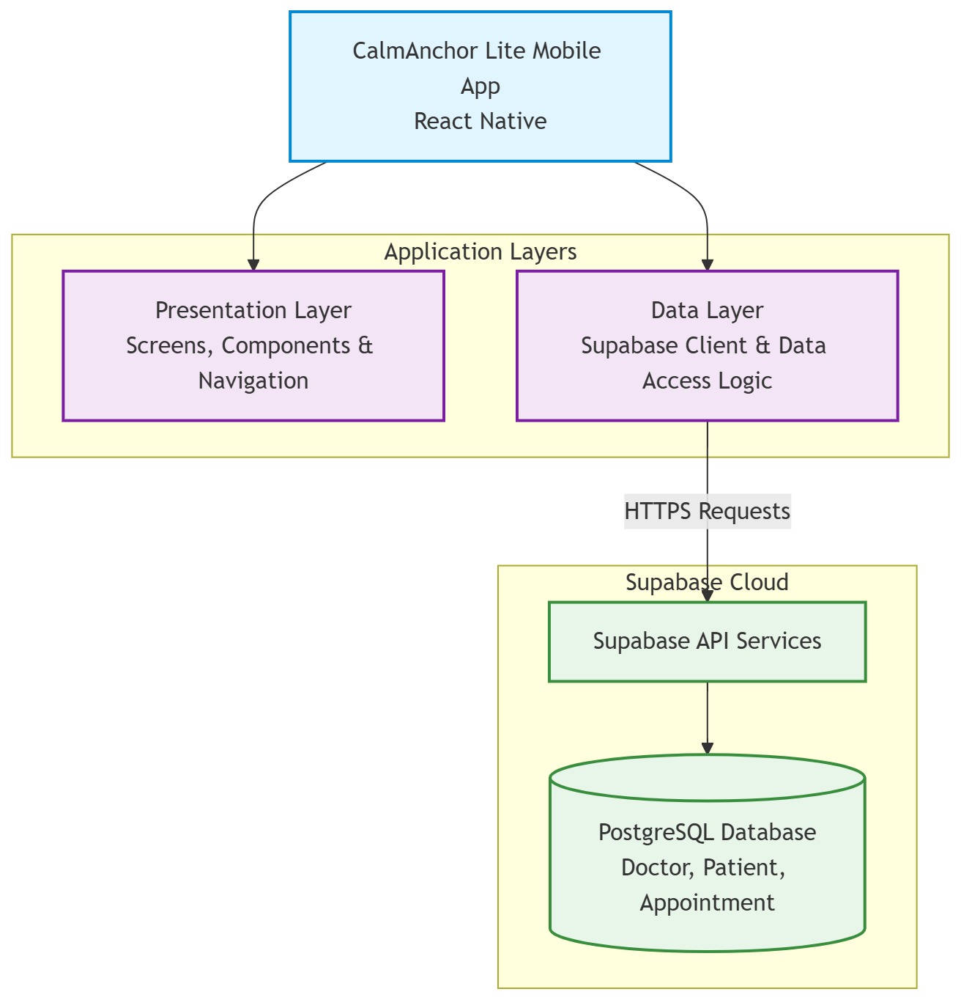

# CalmAnchor Lite

A cross-platform mobile application prototype based on the CalmAnchor CPTSD toolkit workflow.

The project demonstrates a fixed-scenario appointment management system where a single doctor can manage patient information and a daily appointment schedule. The application focuses on relational database design, CRUD operations, and appointment slot management while ensuring that unavailable appointment times are not presented as selectable options.

---

## Project Documentation

All project design and architecture documentation is maintained inside the `/docs` directory.

Current documentation includes:

- [Database Schema & ERD](./docs/database-schema.md)

- [User Journey](./docs/user-journey.md)

- [Screen Map & Navigation](./docs/screen-map.md)

- [System Architecture](./docs/app-architecture.md)

- [Appointment Scheduling Logic](./docs/scheduling-logic.md)

Together, these documents describe the application's database design, navigation flow, scheduling logic, and overall architecture throughout development.

## Architecture Diagram

The architecture diagram illustrates how CalmAnchor Lite is organised into distinct layers to separate user interface logic from data access.Screens never communicate directly with Supabase. Instead, all database access is encapsulated within dedicated service modules that consume a shared Supabase client configured in src/lib/supabase.ts. This layered structure improves maintainability, keeps responsibilities clearly separated, and allows each feature to evolve without tightly coupling the UI to the backend.

## Architecture & State Management

CalmAnchor Lite follows a layered React Native architecture consisting of a Presentation Layer and a Data Layer.

The Presentation Layer contains the application's screens, reusable components, and navigation logic. React Navigation manages stack movement across all five integrated screens:

1. **Day Schedule** (Home & Central Hub)
2. **Patient List**
3. **Patient Detail**
4. **Change Appointment** (Rescheduling Form)
5. **Settings** (Doctor Profile)

The Data Layer communicates with Supabase through dedicated service modules, keeping database queries cleanly separated from the user interface components.

### State Management Strategy

State is managed strictly at the component level using React hooks (`useState`, `useEffect`, and `useFocusEffect`). Because data requirements are tied to specific screens and cross-screen context is cleanly passed via React Navigation route parameters (such as `patientId` or `appointmentId`), global state containers like React Context or Redux were intentionally omitted. This lightweight, param-driven approach avoids unnecessary architectural complexity while keeping state predictably isolated per screen.

### Architectural Evolution Across Phases

The foundational data layer and database client were established in Phases 1 & 2, core stack navigation was implemented in Phase 3, appointment rescheduling state logic was added in Phase 4, and final end-to-end navigation assembly was completed in Phase 5.

## Database Choice

The application uses Supabase (PostgreSQL) as its cloud database.

The schema consists of three core entities:

- Doctor
- Patient
- Appointment

Database integrity is enforced through foreign keys, `UNIQUE` constraints, and `CHECK` constraints. Appointment scheduling rules—such as fixed 20-minute appointments, working hours, and prevention of duplicate bookings—are validated by PostgreSQL constraints in addition to frontend validation.

The database was seeded with one doctor, five patients, and five appointments to support development and testing.

## Technology Stack

- React Native (Expo)
- TypeScript
- Supabase (PostgreSQL)
- React Navigation (Native Stack Navigator)

---

## Key Features

- View today's appointments
- Browse all patients
- View patient medical history
- Reschedule appointments with a real-time slot algorithm
- Automatic prevention of double booking
- Doctor profile screen

Appointment availability is validated at two levels: the UI proactively filters unavailable slots for a better user experience, while PostgreSQL constraints provide a final guarantee that invalid or conflicting appointments cannot be stored.

---

## Development Workflow

The project was developed using a strict Git Flow methodology.

To maintain a clean main branch, every major feature and documentation update was implemented on an isolated feature branch. These branches were thoroughly tested and reviewed before being merged into `main` via Pull Requests. Merged branches were subsequently deleted to maintain repository hygiene.

Examples of executed feature branches include:

- `feature/day-schedule`
- `feature/patient-management`
- `feature/change-appointment-form`
- `feature/application-assembly`
- `docs/phase4-documentation`

Completed development stages:

1. Project documentation and architecture design ✅
2. Database integration and initial data setup ✅
3. Day Schedule screen with live appointment data retrieved from Supabase ✅
4. Patient management (Patient List, Patient Detail, and navigation) ✅
5. Appointment rescheduling logic and collision algorithm ✅
6. Application assembly, final testing, and Android build preparation ✅

Each major feature was developed in its own feature branch and merged into `main` only after feature completion, manual testing, and verification logging.

---

## 🤖 Agent Usage Disclosure

AI-assisted tools were used throughout the development process to support planning, learning, implementation, and documentation.

- **Google Gemini:** Utilized for project planning, breaking down academic rubric requirements into structured development phases, generating step-by-step implementation guides, drafting code architectures, writing technical documentation, and organizing git commit strategies.
- **ChatGPT:** Utilized to deepen understanding of React Native concepts (including navigation stack patterns, component lifecycles, and TypeScript typing), troubleshoot environment and build configurations, and clarify debugging logic during development.

All AI-generated code snippets, architectural recommendations, and documentation content were critically reviewed, manually integrated, tested in the local environment, and verified to make sure full alignment with project requirements.
