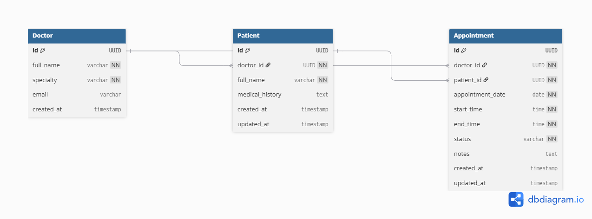

# System Architecture

## High-Level Mobile Application Architecture

This diagram shows the overall structure of CalmAnchor Lite and how the main parts of the application communicate with each other.

The React Native application is separated into different responsibilities. The Presentation Layer contains the screens, components, and navigation logic, while the Data Layer handles communication with Supabase and manages access to application data. This separation keeps the codebase organised and makes individual parts of the application easier to maintain.

## Supabase Database Architecture

CalmAnchor Lite uses Supabase as the cloud backend for storing and retrieving application data.

The React Native application communicates with Supabase through the Supabase JS SDK. This allows the application to interact with the PostgreSQL database using structured queries while keeping the database operations separate from the user interface.

The database contains the core entities required for the application:

- Doctor
- Patient
- Appointment

These relationships are managed through PostgreSQL foreign keys to maintain data consistency.
