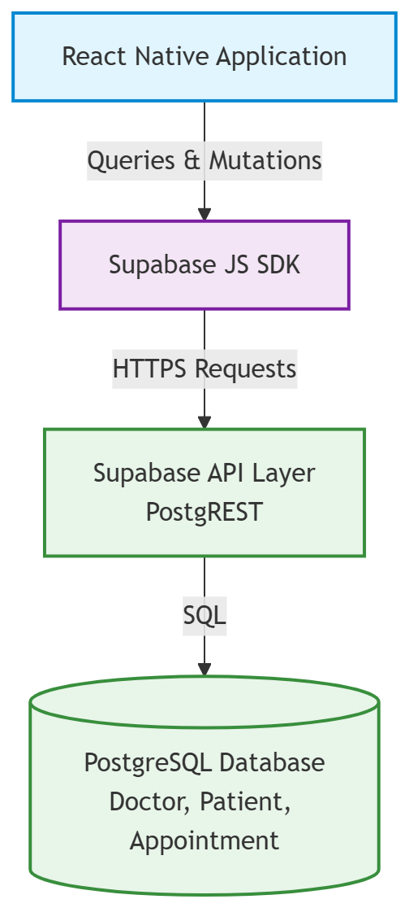

# System Architecture

## High-Level Mobile Application Architecture

This diagram illustrates the structure of CalmAnchor Lite and the communication between the elements of the application.

The React Native application is split up into various responsibilities. The Presentation Layer includes the screens, components and navigation logic. Access to the application's data is handled by the Data Layer and Supabase is accessed via Supabase JavaScript SDK. In this layer, accessing the database is done via specific service modules, and the configuration for the client is stored in src/lib/supabase.ts

## Supabase Database Architecture

CalmAnchor Lite stores and retrieves application data via Supabase cloud backend.

The React Native application communicates with Supabase through the Supabase JS SDK. The application can then query and manipulate the PostgreSQL database with structured queries without mixing UI controls with the database.

The database has the following core entities:

Doctor

Patient

Appointment

> **Engineering Note**

> All database tables and columns are strictly named using lowercase casing (e.g., doctor, patient_id). This standardizes the schema and avoids PostgreSQL's strict requirement for double-quoting capitalized identifiers during queries.

These relationships are managed through PostgreSQL foreign keys to keep data consistency.
