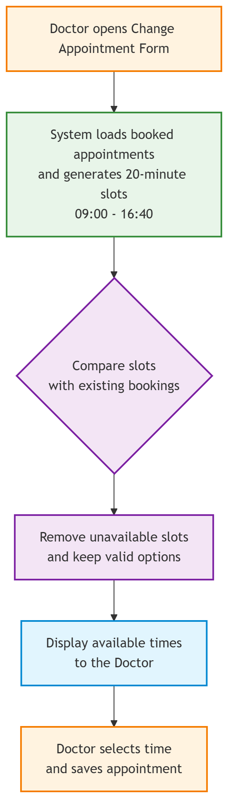

# Appointment Scheduling Logic Flow

This document provides an explanation of how **CalmAnchor Lite** responds to changes in appointments and how it filters out of the available options.

---

## Appointment Slot Filtering

When the doctor opens the **Change Appointment Form**, the application fetches the existing appointments for the selected day and compares them against the available 20-minute appointment slots.

The application filters out the unavailable slots before showing them, rather than allowing the doctor to select any time and handling conflicts _after_ submission.This improves usability by ensuring that unavailable appointment times are never presented as selectable options, reducing invalid user actions before submission.

## Process Overview

The underlying logic follows a strict six-step execution:

1. The doctor opens the **Change Appointment Form**.
2. The application loads existing appointments for the selected day from the database.
3. Available **20-minute slots** (from 09:00 to 16:40) are generated in memory.
4. Existing bookings are cross-referenced and compared against the available slots.
5. Occupied times are actively removed from the available options array.
6. The doctor selects a guaranteed-available time and saves the updated appointment.

> **Engineering Rationale:**
> This makes the front end scheduling logic simple and extremely responsive, which meets the core requirement that booked appointment slots must never appear as selectable options to the user.
