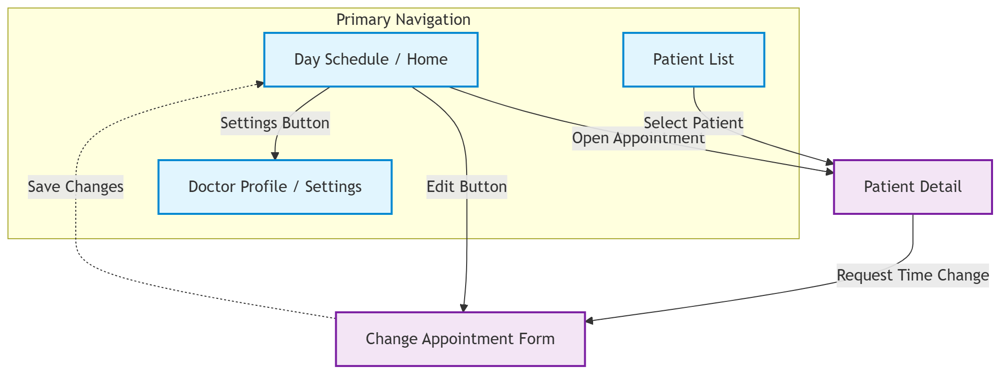

# Screen Map

This diagram shows the navigation flow of CalmAnchor Lite and how the main screens are connected. The Day Schedule acts as the starting point for managing the doctor's daily appointments, while patient information and appointment changes can be accessed through related screens.

### Navigation Structure

**1. Day Schedule (Home)**

- The central hub where the doctor views the dynamically counted appointments scheduled for the day.
- → _Opens:_ **Patient Detail** (via tapping an appointment)
- → _Opens:_ **Change Appointment Form** (via Edit button)
  - → _After saving changes:_ Returns to the updated **Day Schedule**
- → _Opens:_ **Patient List** (via All Patients button)
- → _Opens:_ **Doctor Profile / Settings** (via Settings button)

**2. Patient List**

- Displays all patients managed by the doctor.
- → _Opens:_ **Patient Detail** where the doctor can view specific patient information and medical history.

**3. Doctor Profile / Settings**

- A read-only screen that queries the database to display the active doctor's verified profile (Name, Specialty, and Email).
- Implements a strict Loading → Error → Content UI cycle to ensure stable data fetching.
