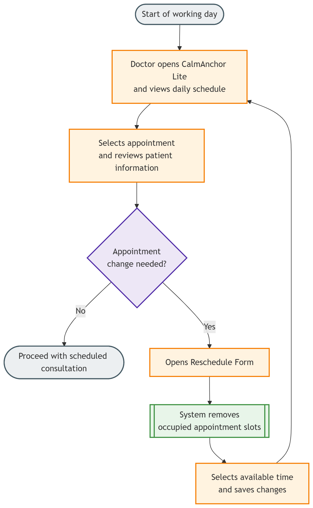

# User Journey

This diagram shows the typical workflow of a doctor using CalmAnchor Lite throughout the day. It focuses on reviewing upcoming appointments, accessing patient information when needed, and safely rescheduling appointments while avoiding time conflicts.

### Scenario Overview

* **Actor:** Doctor (the only user of the application)
* **Goal:** Manage the day's appointments efficiently and have quick access to relevant patient information.
* **Trigger:** A patient needs to change their scheduled appointment time.
* **System Response:** The application identifies available appointment slots and prevents the doctor from selecting an already-booked time.
* **Outcome:** The appointment is successfully moved and the updated schedule is displayed.

### Journey Flow

1. **Start the day:** The doctor opens CalmAnchor Lite and views the daily schedule.
2. **Review appointments:** The doctor checks upcoming appointments and selects a patient appointment when more information is needed.
3. **View patient information:** The doctor reviews the patient's history and notes before the consultation.
4. **Appointment change request:** If a patient needs to change their appointment time, the doctor opens the rescheduling form.

   * If no change is required, the doctor continues with the existing schedule.
   * If a change is required, the doctor selects a new available time slot.
5. **Slot validation:** The application filters out existing bookings and only displays available appointment slots.
6. **Confirm change:** The doctor selects a suitable time and saves the updated appointment.
7. **Complete:** The schedule is updated, and the doctor returns to the daily schedule view.
