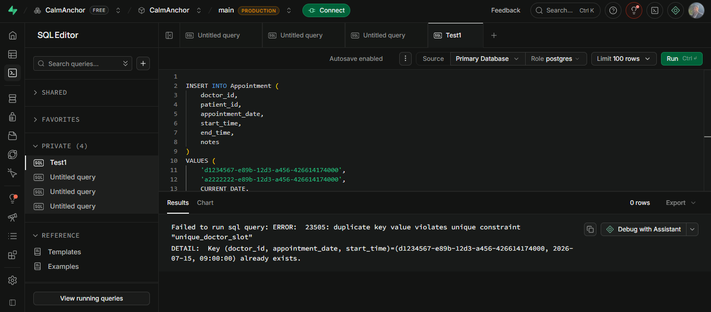
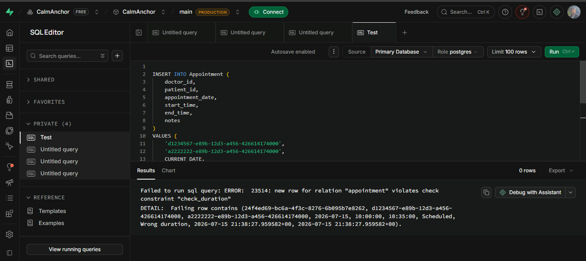
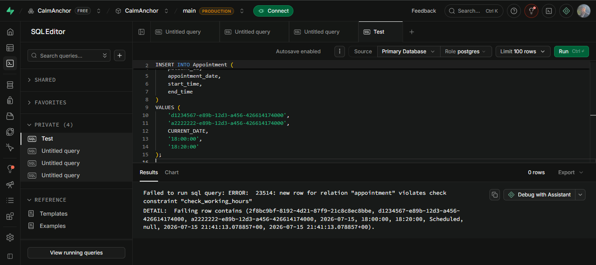
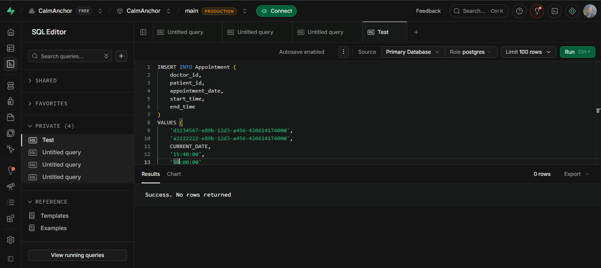
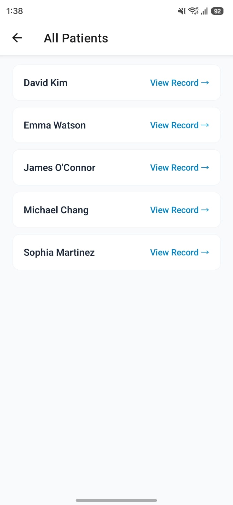
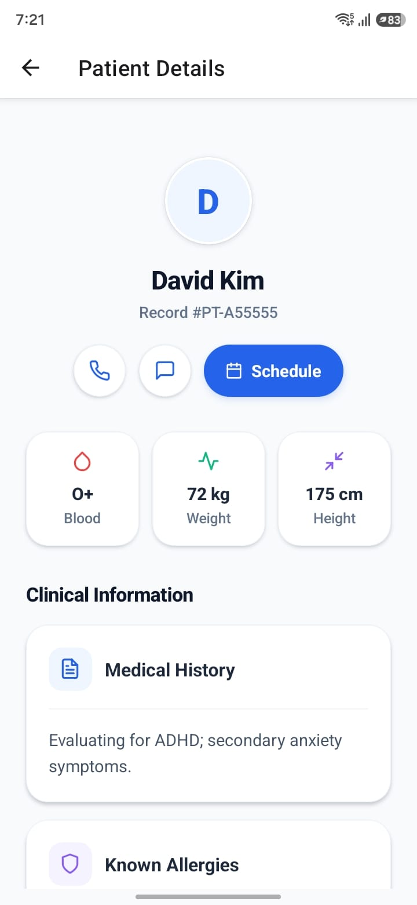
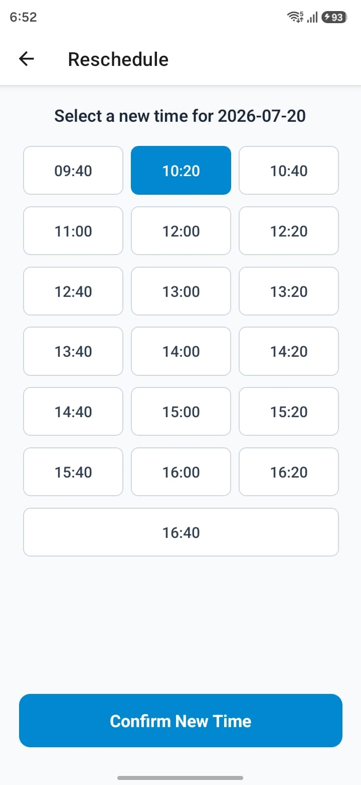
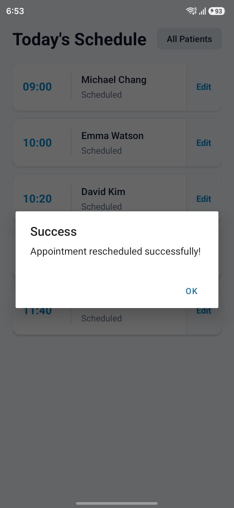

# Database Verification Log

This document records the manual verification carried out throughout the implementation of CalmAnchor Lite.

The verification process confirms that the database constraints, data retrieval, and application behaviour operate as expected during development.

---

## Verification Summary

| Test                              | Expected Result               | Outcome |
| --------------------------------- | ----------------------------- | ------- |
| Duplicate appointment booking     | Rejected                      | Passed  |
| Invalid appointment duration      | Rejected                      | Passed  |
| Invalid appointment status        | Rejected                      | Passed  |
| Appointment outside working hours | Rejected                      | Passed  |
| Valid appointment                 | Insert succeeded              | Passed  |
| Live appointment retrieval        | Appointments displayed        | Passed  |
| Patient List retrieval            | All seeded patients displayed | Passed  |
| Patient Detail retrieval          | Selected patient loaded       | Passed  |
| Navigation to Patient Detail      | Opens correct patient         | Passed  |

---

## Development Challenges & Resolutions

During Phase 4, a notable integration challenge was encountered and successfully resolved:

- **Issue:** When attempting to load the Change Appointment screen, a PostgreSQL error was thrown: `invalid input for type date "undefined"`.
- **Root Cause:** The `currentDate` parameter was passing as `undefined` through React Navigation because the initial Supabase `SELECT` query in the Day Schedule screen omitted the `appointment_date` column in its payload.
- **Resolution:** The data fetching utility (`getTodayAppointments`) was updated to explicitly include `appointment_date` in the `.select()` statement. This successfully passed the strict date string to the routing params, satisfying both React Navigation and PostgreSQL strict type requirements.

---

## Verification Evidence

### Duplicate booking rejected

The database rejected an attempt to create two appointments for the same doctor at the same date and time, confirming that the `UNIQUE` constraint prevents duplicate bookings.

---

### Invalid duration rejected

The database rejected an appointment whose duration was different from the required 20 minutes, confirming that only fixed 20-minute appointments are accepted.

---

### Outside working hours rejected

The database prevented an appointment from being created outside the configured working hours (09:00–17:00), confirming that scheduling rules are enforced by PostgreSQL.

---

### Valid appointment inserted successfully

A correctly formatted appointment satisfying every database constraint was inserted successfully.

---

### Phase 2 – Live appointment retrieval

The Day Schedule screen successfully retrieved live appointment data from Supabase, displaying the seeded appointments for the selected day.

---

### Phase 3 – Patient List

The Patient List screen successfully retrieved all seeded patients from Supabase, confirming that the application can display the complete patient dataset.

---

### Phase 3 – Patient Detail

Selecting a patient from either the Day Schedule or the Patient List opened the correct Patient Detail screen and displayed the patient's medical history retrieved from Supabase.

## 

---

### Phase 4 – Available slots calculation

The Change Appointment screen successfully retrieved currently booked times from the database and mathematically filtered them out of the generated 20-minute interval list, preventing the user from double-booking existing slots.

---

### Phase 4 – Appointment rescheduled successfully

Submitting a new time triggered a successful database mutation. The application provided a success alert, routed the user back to the Day Schedule, and automatically re-fetched the data to display the newly updated time.

## Conclusion

Manual verification was carried out after each completed phase of development.

The database consistently enforced scheduling rules, rejected invalid records, accepted valid data, and successfully served relational data to the application through Supabase.
