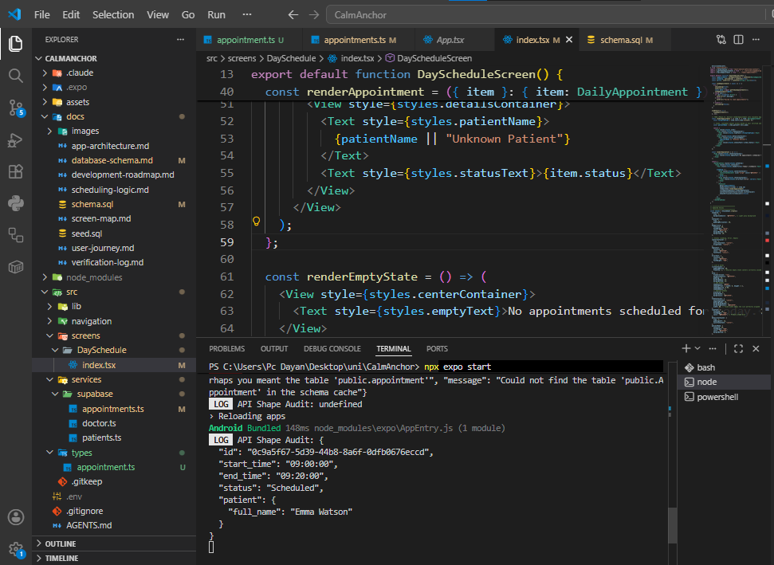

# Database Verification Log

This document records the manual verification carried out after implementing the Phase 1 database schema in Supabase.

The aim was to confirm that the database constraints behave as expected before any application logic is built.

---

## Verification Summary

| Test                              | Expected Result  | Outcome |
| --------------------------------- | ---------------- | ------- |
| Duplicate appointment booking     | Rejected         | Passed  |
| Invalid appointment duration      | Rejected         | Passed  |
| Invalid appointment status        | Rejected         | Passed  |
| Appointment outside working hours | Rejected         | Passed  |
| Invalid slot alignment            | Rejected         | Passed  |
| Valid appointment                 | Insert succeeded | Passed  |

---

## Example Verification

The following SQL was used to verify that the database prevents duplicate bookings.

```sql
INSERT INTO Appointment (
    doctor_id,
    patient_id,
    appointment_date,
    start_time,
    end_time,
    notes
)
VALUES (
    'd1234567-e89b-12d3-a456-426614174000',
    'a1111111-e89b-12d3-a456-426614174000',
    CURRENT_DATE,
    '09:00:00',
    '09:20:00',
    'Duplicate booking test'
);
```

**Expected:** The insert is rejected by the `unique_doctor_slot` constraint.

**Result:** The database rejected the insert.

---

## Evidence

### Duplicate booking rejected

The database rejected an attempt to create two appointments for the same doctor at the same date and time, confirming that the `UNIQUE` constraint is enforced.


---

### Invalid duration rejected

The database rejected an appointment whose duration was different from the required 20 minutes, confirming that the duration constraint is working as intended.


---

### Outside working hours rejected

The database prevented an appointment from being created outside the configured working hours (09:00–17:00), demonstrating that the working-hours validation is enforced.


---

### Valid appointment inserted successfully

A correctly formatted appointment satisfying all database constraints was inserted successfully, confirming that valid records are accepted.


---

### Phase 2 – Live appointment retrieval

The Day Schedule screen successfully retrieved live appointment data from Supabase, displaying the seeded patient records together with their scheduled appointment times.



---

## Conclusion

All database constraints were manually verified using the Supabase SQL Editor.

The database successfully rejected invalid data while accepting valid appointment records, confirming that the schema enforces scheduling rules independently of the application.
